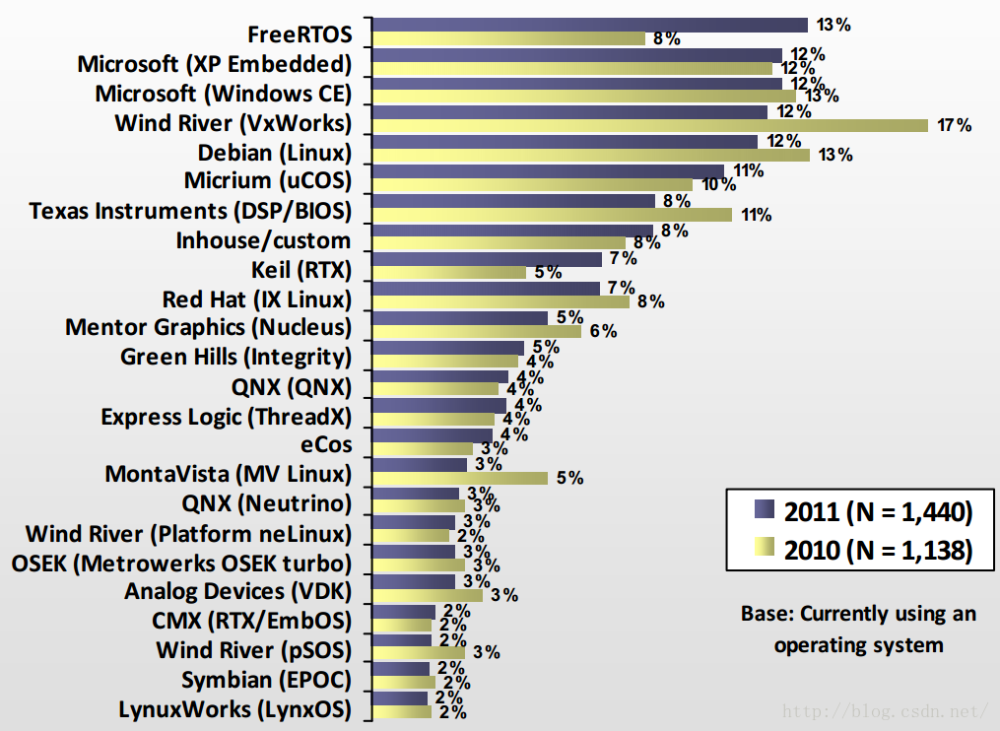

曾经和同事一起吃饭，听他们吐槽程序员压力太大，我开玩笑说去送外卖会不会更好；但细数了一下，还是程序员香。

我想，能够选择程序员作为职业生涯的开始应该算是一种幸运：收入还行，虽然会顶着项目进度的压力，但只需要吃学习的苦。

现在软件开发非常热门，下至各种操作系统、上至五花八门的框架；让初学者眼花缭乱，很多人很迷茫，担心学习的某样东西以后很快被新兴事物代替。

我曾听过亚马逊创始人Jeff Bezos说过的一句话：

> 人们经常问,在接下来的10年里，会有什么样的变化。但是我只问,未来的10年，什么是不变的？——Jeff Bezos

我认为，行业和方向都不是最重要的，按我对《软技能：代码之外的生存指南》其中提到的“冲量”的理解，竞争力=选择+积累。

## 程序员的三大方向

韦东山将程序员的方向分为3类：**专业领域**、**业务领域**、**操作系统领域**。而按我的理解是：**专业领域**，**业务领域**，**底层领域**。

负责**底层领域**的人，主要的工作是向其他开发人员提供操作底层硬件的接口，有时候甚至需要搭建业务开发人员程序运行的系统环境，计算软件运行时所需要的最小资源；配合硬件工程师进行联调，从软、硬件2个角度排除解决PCBA上存在的问题；有时候还需要参与硬件设计（主要是CPU外围），设计行业应用的数据链路架构。

从事**业务开发**的人，需要了解一些操作系统知识，善用各种库进行，常常使用操作系统的接口（系统调用）进行应用层开发。一般都需要从行业出发、对产品有一定的认识，了解一些业务需求，搞清楚业务的关系。

> 所以，当领导的人，多是做应用的。一旦钻入了某个行业，很难换行业。因此，选择一个好的行业非常重要。——韦东山

对**专业开发**的人来说，他们常常面对的是业务中某一个核心需求的实现，像科研人员一样，更多地需要对理论知识有足够的积累；高数中的很多东西是他们的老朋友；编程语言只是他们实现目标的工具。

这3类工种直接可以没有明确的界定，只要学习能力足够强，甚至可以相互转换，而且这种转换后的变化可能是更加得心应手的工作。

我们来讲讲底层领域吧。

## 底层领域

底层开发需要在于芯片厂商或者板级开发商的BSP，包括3种：

0、BSP开发

1、裸机开发

2、基于操作系统的驱动开发

**BSP开发**：我曾经以为底层移植需要从通用的BootLoader或者kernel做移植，没成想实际上这一块属于板级供应商的工作。除非是进入到这些供应商从事工作或者进行产品底层的深度定制，否则没啥机会用到芯片上的编程经验。

> 实际上，大部分的移植工作都只是简单的适配。

**裸机开发**往往是面对一些对资源要求比较苛刻，无法运行操作系统的场景。例如物联网领域，尤其是通过电池供电产品；也有一些不需要上系统的原因在于调度和通讯的方式比较简单，用前后台（轮询+中断）系统足以解决这些问题。

而**操作系统开发**的开发根据系统的不同而不同；嵌入式常见的操作系统很多（过时的WinCE就不说了），由简到难的有：uCos、FreeRTOS；VxWorks，RT-Thread，Linux...

其中，比较成熟而被人广泛认识的有：Linux、FreeRTOS、RT-Thead。

我建议学习的路线，“从裸机到系统”：

0、学习一款MCU，例如STM32

1、了解操作系统原理

2、买个资料丰富、有条理而且社区友好的开发板，移植并开发有关的系统

3、在2的基础上，研究Linux

当然，不仅如此，经常和硬件工程师打交道也是一项工作内容。

操作系统领域所包含的内容，简单地说，就是制作出一台装好系统的专用“电脑”，可以分为：

- 为产品规划硬件：按需求、性能、成本和资源选择主芯片，搭配周边外设，交由硬件开发人员设计。
- 给单板适配操作系统、编写驱动以控制外部设备
- 定制维护、升级等整体量产方案
- 为应用开发人员搭建开发环境
- 从系统角度解决疑难杂症

> 韦东山：我在中兴公司上班时，写驱动的时间其实是很少的，大部分时间是调试：系统调优，上帮APP工程师、下帮硬件工程师查找问题。我们从厂家、网上得到的源码，很多都是标准的，当然可以直接用。但是在你的产品上也许优化一下更好。比如我们可以把摄像头驱动和DMA驱动揉合起来，让摄像头的数据直接通过DMA发到DSP去。

我们可以在软件和硬件之间起桥梁作用，对于实体产品，有可能是软件出问题也可能是硬件出问题，一般是底层系统工程师比较容易找出问题。当硬件、软件应用出现问题，他们解决不了时，从底层软件角度给他们出主意，给他们提供工具。再比如方案选择：芯片性能能否达标、可用的BSP是否完善等等，这只能由负责整个方案的人来考虑，他必须懂底层。

在操作系统领域，对知识的要求很多：

- 外语能力：熟读各种芯片手册（我曾见过一种很少见的配置说明，要需要有一定的理解能力）
- 硬件能力：懂硬件知识才能看懂电路图
- 系统框架：有编写、移植驱动程序的能力，汇编
- 系统理论：对操作系统本身有一定的理解，才能解决各类疑难问题
- 通信协议：从最简单的串口到SPI、IIC、CAN上至TCP/IP
- 驱动开发：外设的配置
- 应用开发：C/C++

**缺点：** 它绝对是一个大坑，没有兴趣、没有毅力的人慎选：

- 发育缓慢：广而杂的知识，要学很久；没有经验的时候，需要从软件开发开始学习
- 岗位机会少：绝对比APP的职位少（数量减少、薪资提高）
- 门槛高（当然薪水相对就高）

**优点**：

- 不担心行业限制：学好后，行业通杀，想换行就换行；想自己做产品就自己做产品。
- 工作量稳定：不会被经常变动的需求搞得天天加班。（所以说文档先行，先规划再开发）

**驱动开发，我认为适合于这些人：**

1、硬件工程师：想转软件开发，从底层软件入门会比较好，硬件经验能够用得上；

2、应用开发人员：想深入了解底层的人，不会整天被底层卡脖子；

3、裸机开发人员：面对日益复杂的资源调度处理开始力不从心；有资源能够上系统的硬件平台可以搞搞。

4、想拥有整体调试能力的人：拥有底层能力对调试来讲是一把利刃；

**嵌入式软件中一定有的部分：**

- 简单的OS：内核、驱动、任务。
- 比较庞大的OS：bootloader、内核、驱动、文件系统、应用程序（任务）。

## 零基础快速入门

假设您是零基础，我们规划了如下入门路线图：

> 前面的知识，是后面知识的基础，建议按顺序学习。每一部分，不一定需要学得很深入透彻

### 软件

C语言：

- 基本语法
- 结构体、指针
- 复杂宏定义

通用：

- 数据结构+算法

### 应用

PC-Linux（例如Centos、Ubuntu）

- Linux常见命令
- 开发环境配置、搭建
- Linux常见编辑器的使用（vim，emacs）

### 硬件

- 原理图、芯片手册
- 各类通讯协议

> 我们学习硬件知识的目的在于能看懂原理图，看懂通信协议，看懂芯片手册；**不求能设计原理图，更不求能设计电路板**。对于正统的方法，你应该这样学习：
>
> ①学习《微机原理》，理解一个计算机的组成及各个部件的交互原理。
>
> ②学习《数字电路》，理解各种门电路的原理及使用，还可以掌握一些逻辑运算（与、或等）。

## 嵌入式学习路线

### 裸机程序

**概述：**从简单的裸机开发入手，先掌握硬件操作。对于基于ARM+Linux的裸机学习，这么做可以学得更深，并且更贴合后续的Linux学习。

> Linux驱动开发 = Linux驱动程序软件框架 + 通过软件操作硬件

实际上这个部分就是`通过软件操作硬件`：不需要依赖其他框架，你可以按你自己的意愿来组织编写代码；你只需要知道如何读写物理地址即可。（必要时，使用芯片提供的资源对硬件进行控制）

一切从零编写代码、管理代码，可以让我们学习到更多知识：

> 实际上这些知识在BootLoader中学习会更有体会

- 需要了解芯片的上电启动过程，知道第1条代码如何运行
- 需要掌握怎么把程序读入内存
- 需要理解内存怎么规划使用，比如栈在哪，堆在哪
- 需要理解代码重定位
- 需要知道中断发生后，软硬件怎么保护现场、跳到中断入口、调用中断程序、恢复现场

你会知道：

- main函数不是我们编写的第1个函数（链接地址，加载地址的概念等内容）
- 芯片从上电开始，程序是怎么被搬运执行的（不同芯片加载代码的差异）
- 函数调用过程中，参数是如何传递的（C函数形参列表与汇编寄存器的对应关系）
- 中断发生时，每一个寄存器的值都要小心对待（异常模式）
- 代码段、数据段、BSS段（程序在内存中的分布情况）
- 程序的运行：上电复位、代码重定位、位置无关码、CPU异常/中断
- 驱动硬件：时钟，内存，中断，GPIO，IIC，SPI，Flash，LCD等（片内资源如何使用）

学习裸机开发的目的有两个：

1、掌握裸机程序的结构，为后续的u-boot作准备

2、练习硬件知识，即：怎么看原理图、芯片手册，怎么写代码来操作硬件

> 后面的u-boot可以认为是裸机程序的集合，我们在裸机开发中逐个掌握各个部件，再集合起来就可以得到一个u-boot了。后续的驱动开发，也涉及硬件操作，你可以在裸机开发中学习硬件知识。
>
> 注意：如果你并不关心裸机的程序结构，不关心bootloader的实现，这部分是可以先略过的。

推荐两本书：杜春蕾的《ARM体系结构与编程》，韦东山的《嵌入式Linux应用开发完全手册》。

### BootLoader

**概述：**

如果你是软件工程师，无论是ARM9、ARM11、A8还是A9，对我们来说是没有差别的。一款芯片，上面有CPU，还有众多的片上设备(比如UART、USB、LCD控制器)。我们写程序时，并不涉及CPU，只是去操作那些片上设备。

所以：差别在于片上设备，不在于CPU核；差别在于寄存器操作不一样。

因为我们写驱动并不涉及CPU的核心，只是操作CPU之外的设备，只是读写这些设备的寄存器。

**学习目标：**

- uboot框架、修改uboot命令、uboot启动内核的细节
- 适配uboot的方法（适配相近的硬件板子到实际的板子上，并做修改）
- 读写不同的介质下的程序
- 调通网络，能够启动内核

**学习方法：**

①先学习《从零编写bootloader》，这可以从最少的代码理解bootloader的主要功能

②再看书上对u-boot的讲解，并结合《分析u-boot 1.1.6的视频》来理解

③最后，有时间有兴趣的话，看《移植一个全新u-boot的视频》，这不是必须的。

**学习程度：**

- 理解u-boot的启动过程，特别是u-boot代码重定位：怎么从Flash上把自己读入内存
- 知道bootloader如何给内核传递参数
- 知道bootloader是根据“bootcmd”指定的命令启动内核
- 掌握BootLoader一些调试技巧

### 内核

**描述：**内核本身不是我们学习的重点，但是了解一下内核的启动过程，还是很有必要的：工作中有可能要修改内核以适配硬件，掌握了启动过程才知道去修改哪些文件。

- 结合代码分析内核启动流程
- 配置、适配内核

**学习程度：**

①知道机器ID的作用，根据机器ID找到单板对应的文件

②知道Makefile、Kconfig的作用，知道怎么简单地配置内核

③知道怎么修改分区

④作为入门：只求理解，不要求能移植

### 文件系统

文件系统的学习其实指的是：构建一个根目录文件系统，此后将其制作为镜像；这个镜像的类型是我们平时所说的

**概述：**

在驱动程序开发阶段，我们喜欢搭建一个最小根文件系统来调试驱动；

在开发应用程序时，也需要搭建文件系统，把各种库、配置文件放进去；

在发布产品时，你还需要修改配置文件，使得产品可以自动运行程序；

甚至你想实现插上U盘后自动启动某个程序，这也要要修改配置文件；

这一切，都需要你理解根文件系统的构成，理解内核启动后是根据什么配置文件来启动哪些应用程序。

**学习内容：**

- init进程
- 构建最小根文件系统，烧写到单板上

**学习程度：**

①理解配置文件的作用

②知道根文件系统中lib里的文件来自哪里

③可以制作、烧写文件系统映象文件

### 驱动

#### 字符驱动设备

**描述：**

对每一个驱动，先了解硬件原理，然后从零写代码，从简单到复杂，逐渐完善它的功能。

以LED、按键驱动为例，练习开发过程中碰到的机制：查询、休眠-唤醒、中断、异步通知、poll、同步、互斥等等。后续更复杂的驱动程序，就是在这些机制的基础上，根据硬件特性设计出精巧的软件框架。

**学习内容：**

- 设备框架
- 应用与驱动的关系
- 查询、中断、休眠唤醒、poll、异步、同步、互斥、阻塞

**学习路线：**

- 字符设备驱动程序之概念介绍、编写编译、测试改进、操作LED
- 字符设备驱动程序之查询方式的按键驱动程序
- 字符设备驱动程序之中断方式的按键驱动：Linux异常处理结构、Linux中断处理结构、编写代码、poll机制、异步通知、同步互斥阻塞、定时器防抖动
- 输入子系统概念介绍、编写驱动程序
  - 应用程序、库、内核、驱动程序的关系
  - Linux驱动程序的分类和开发步骤
  - 驱动程序的加载和卸载
- 字符设备驱动程序开发
  - 字符设备驱动程序中重要的数据结构和函数
  - LED驱动程序源码分析
- Linux异常处理体系结构
  - Linux异常处理体系结构概述
  - Linux异常处理的层次结构
  - 常见的异常
- Linux中断处理体系结构
  - 中断处理体系结构的初始化
  - 用户注册中断处理函数的过程
  - 中断的处理过程
  - 卸载中断处理函数
  - 使用中断的驱动程序示例
  - 按键驱动程序源码分析、测试程序情景分析

**学习方法：**

1、沿着数据流向，从应用程序出发，对驱动程序的使用进行情景分析。

所谓情景分析，就是假设应用程序发起某个操作，你去分析其中的运作过程。比如应用程序调用open、read、ioctl等操作时涉及驱动的哪些函数调用。你要思考一个问题：一个应用程序，怎么获得按键信息，怎么去控制LED。把其中数据的流向弄清楚了，对字符驱动程序也就基本理解了。

2、学习异常和中断时，可以结合书和视频；对于驱动程序中其他内容的学习，可以不看书。

#### 其他常见驱动

**概述：**

学习不同的驱动有2个好处：

1、在你工作中遇到同类驱动时提供借鉴

2、供你学习、练习，煅炼阅读驱动程序的“语感”，提升编写程序的能力，增加调试经验

也许有人说：在工作中我们基本上只是移植、修改驱动而已，很少从头编写。这话没错，但是能修改的前提是理解；想更好地理解，最好的方法是从零写一个出来。在学习阶段，不要怕耗费太多时间，从零开始编写，慢慢完善它，在这过程中你既理解了这个驱动，也煅炼了能力，做到触类旁通。

**学习内容：**

- 输入子系统、输出系统（LCD）、USB设备驱动，块设备（FLASH）驱动、网卡驱动，IIC，SPI,声卡，摄像头，热插拔。

**学习方法：**

1、再次强调，不能光看不练：一定要写程序，即使照抄也得写

2、必学：NAND Flash、Nor Flash、hotplug_uevent机制、IIC、SPI

3、学完之后，强烈建议换一个不同的开发板，尝试在新板上写驱动程序。

直到你自认为：

1、给你一个新板，你可以很快实现相关驱动

2、给你一个新硬件，你可以很快给它编写/移植驱动。

按视频学习会一切顺利，很多问题你可能没想到、没想通，换一个新板会让你真正掌握。

**学习路线：**

- 驱动程序分层分离概念、总线驱动设备模型
- USB驱动程序
- 块设备驱动程序
- NAND FLASH驱动程序
- NOR FLASH驱动程序
- 网卡驱动程序
- 移植DM9000C驱动程序
- 内核下的I2C驱动程序
- DMA驱动程序
- hotplug_uevent机制

#### 驱动调试

有一种说法，程序是三分写七分调。大部分人很快可以写完程序，但是会把大部分的时间花在调试上面。

**驱动调试：**

- JTAG原理与调试
- printk的使用
- 打印到proc虚拟文件
- 根据pc值确定出错的代码位置、根据栈信息确定函数调用过程
- 自制工具：寄存器编辑器（devmem）
- 修改系统时钟中断定位系统僵死问题

**应用调试：**

- 使用strace命令跟踪系统调用
- 使用gdb和gdbserver
- 配置修改内核打印用户态段错误信息
- 应用调试之自制系统调用

## 怎么学习嵌入式Linux操作系统？

### 学习操作系统理论知识

可以从中了解到一些基础概念：

1、操作系统常见名词

2、系统各部分的层次结构

3、任务的调度原理

4、常见的操作系统

...

### 简单的操作系统

很多操作系统都不要求芯片有mmu，像FreeRTOS、uCos都是很适合学习的。很容易从中理解到一些操作系统的核心。

### 学习Linux操作系统

**Linux系统本身的知识：**

1、操作系统具有进程管理、存储管理、文件管理和设备管理等功能，这些核心功能非常稳定可靠，基本上不需要我们修改代码。**我们只需要针对自己的硬件完善驱动程序**

2、学习驱动时必定会涉及其他知识，比如存储管理、进程调度。**当你深入理解了驱动程序后，也会加深对操作系统其他部分的理解**

3、Linux内核中大部分代码都是设备驱动程序，可以认为Linux内核由各类驱动构成。但是，要成为该领域的高手，一定要**深入理解Linux操作系统本身，要去研读它的源代码**。

在忙完工作，闲暇之余，可以看看这些书：

- 赵炯的《Linux内核完全注释》，这本比较薄，推荐这本。他后来又出了《Linux内核完全剖析》，太厚了，搞不好看了后面就忘记前面了。
- 毛德操、胡希明的《LINUX核心源代码情景分析》，此书分上下册，巨厚无比。当作字典看即可：想深入理解某方面的知识，就去看某章节。